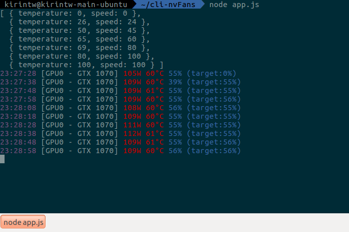

# NvFans

> A simple CLI tool for Linux that can control nvidia GPU fan speed by temperature.

## Tech
- `Node.js` for programming logic
    - Object oriented programming style with `ES6 class`
    - using `child_process` for executing external bash command 
## Screenshot


## Usage
- Requirement:
    - nvidia driver for linux
    	- nvidia-smi
	    - adjustment of `cool-bits` is needed
		- eg: `sudo nvidia-xconfig -a --cool-bits=28 --allow-empty-initial-configuration`
    - Node.js 7.8.0 or newer

```
cd cli-nvFans
node app.js
```

- You can adjust fan speed by editing the json file, then relaunch the app to apply
- multi cards support

## License
The MIT License

Copyright (c) 2017 Kirintw

See the LICENSE file for details.
